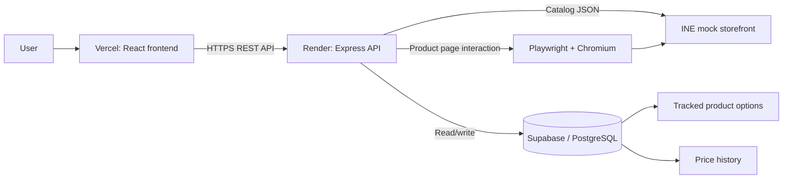
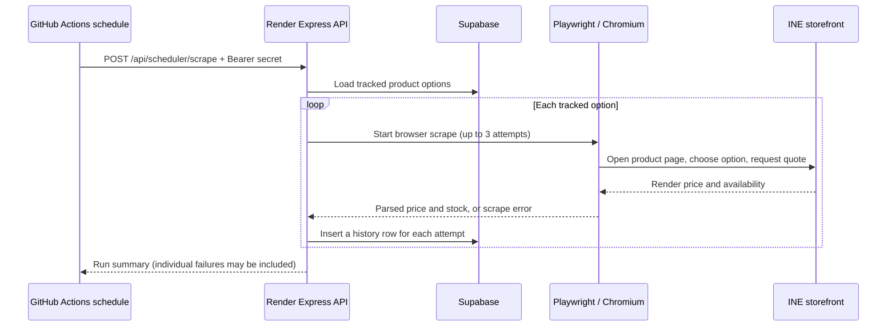

# INE Product Price Tracker

A full-stack application for searching products in INE's mock storefront, tracking a selected product option, and keeping a timestamped history of price, stock, and scrape outcomes. The storefront's catalog is read through its JSON endpoints; its interaction-gated current quote is read from the rendered product page with Playwright.

## Live links

- **Frontend:** [price-tracker-tan-two.vercel.app](https://price-tracker-tan-two.vercel.app/)
- **Backend:** [price-tracker-5350.onrender.com](https://price-tracker-5350.onrender.com/)
- **Source repository:** [YusufMasood/price-tracker](https://github.com/YusufMasood/price-tracker)
- **Storefront:** [INE demo store](https://demo.inelabteamdev.com/)

## Overview

Users search the synchronized product catalog, inspect a product's available options, and track one specific option. The backend stores the tracking choice in Supabase, and a scrape run opens the matching INE product page, performs the required browser interactions, reads the revealed quote, and records the result. A dashboard shows tracked products and their history, and can export all stored history as CSV.

The work focuses on the assignment's difficult-store reliability concerns: slow browser interaction, temporary catalog HTTP failures, throttling, bounded retries, and truthful history for failed as well as successful attempts.

## Architecture



Catalog listing and item details use INE's JSON endpoints. The current quote is obtained from the rendered product page because the quote requires browser-side interaction. Supabase is accessed by the backend; its secret key is not sent to the browser.

## Scheduled scraping flow

The backend exposes a protected endpoint that runs the same scrape runner used by the manual test endpoint. The deployment target is an external GitHub Actions schedule every two hours (UTC):



**Scheduler status:** the protected route is implemented. The current checkout does not contain a `.github/workflows` schedule file; configure one in the GitHub repository to make unattended two-hour runs active. GitHub-hosted runners need network access to the Render service, and the request timeout must allow for the number of tracked products and retries. The schedule can be delayed under GitHub Actions load; check workflow run history and Render logs.

An in-process timer is not used. A sleeping web service cannot reliably keep a timer alive. An external request can wake the Render service, but cold-start delay and the caller's request timeout still apply.

## Features

- Search by full or partial product name, brand, category, or SKU; results are relevance-scored and capped at 10.
- Browse product details and available options; track a specific option independently.
- Persist tracked options and price history in Supabase.
- Scrape the rendered quote and availability with Playwright and Chromium.
- Retry catalog listing requests and product scrapes, with per-attempt outcomes in history.
- View the history for each tracked product and export all history as CSV.
- Trigger a scrape manually during development and through a protected scheduler endpoint in deployment.
- Run Chromium headless on the hosted backend or headed for a visible local demonstration.

## Search and option-level tracking

At backend startup, catalog sync reads page 1 to find the total page count, then loads listing pages sequentially. Search scores exact name matches highest, followed by name prefix and substring matches, then brand, category, and SKU matches. Equal scores retain the order received from the catalog. Search returns at most ten results.

The frontend loads the selected product's details and options before tracking. The backend checks that the submitted option ID belongs to that product. The stored tracking identity is `(store_product_id, option_id)`, so the option is the unit of tracking; a repeated request for the same pair returns the existing tracked row.

The earlier observed catalog sync contained 48 pages and 960 products. This is an observation from the development run, not a fixed catalog size; the storefront can change.

## Storefront discovery and scraping choices

During development, the storefront's frontend behavior was inspected to find the catalog and product metadata requests:

- `GET https://demo.inelabteamdev.com/api/v2/listings?page={page}&limit={limit}`
- `GET https://demo.inelabteamdev.com/api/v2/items/{productId}`

Those endpoints make catalog discovery efficient. They have not been established as a source for the interaction-gated current quote. For price and stock, the scraper uses the actual product page and allows the storefront's browser code to run:

1. Open `/item/{productId}` in Chromium.
2. Wait for page content and handle consent UI.
3. Select the requested option.
4. Interact with the offer panel until the price control becomes enabled.
5. Click the current-price control and wait for the quote to render.
6. Read the rendered price and availability values, then close the browser.

This split keeps catalog requests lightweight while using a browser for the behavior that depends on the storefront UI. The UI selectors and timing are tied to the current mock storefront and may need adjustment if it changes.

## Reliability, retries, and honest history

### Catalog requests

The listing client makes up to three attempts. On failure it waits 1 second and then 2 seconds before the next attempt (exponential backoff). During development, the storefront returned actual `503 Service Unavailable` and `429 Too Many Requests` responses. The logged run retried those pages and completed sync with 960 products. These are observed outcomes, not a guarantee that every future failure will recover. Product-detail requests currently do not have the same retry wrapper.

### Price scrape attempts

The runner processes tracked options sequentially and makes up to three attempts per option, waiting 1 second and then 2 seconds between failures. Each scrape attempt is written to `price_history`:

| Attempt result | `outcome` | Price and stock | Error |
|---|---|---|---|
| Successful scrape | `success` | Values read from the page | Empty |
| Failure with another attempt remaining | `retried` | `NULL` | Captured error message |
| Final failure | `failed` | `NULL` | Captured error message |

The success row's `attempts` value is the attempt number that succeeded; failure rows store the corresponding attempt number. Earlier failed attempts remain visible even when a later attempt succeeds. The API can return HTTP 200 for a completed run while an individual product result reports failure, so callers should inspect the returned `results` and backend logs.

History insertion errors are logged. If Supabase itself is unavailable, the application cannot guarantee that the attempt was persisted; logs are needed to diagnose that case.

## Supabase schema

The backend expects two existing PostgreSQL tables in the Supabase project. The repository code uses these columns; apply or adapt a schema in Supabase before starting the backend. No database migration file is included in this checkout.

### `tracked_products`

| Column | Purpose |
|---|---|
| `id` | Internal tracked-row identifier |
| `store_product_id` | Product ID in the INE storefront |
| `product_name` | Name copied from the catalog |
| `option_id` | INE option identifier |
| `option_label` | Human-readable option name |
| `created_at` | Creation timestamp; used to order scrape runs |

The application checks for an existing `(store_product_id, option_id)` pair before inserting. A database unique constraint on the same pair is recommended to prevent duplicates under concurrent requests.

### `price_history`

| Column | Purpose |
|---|---|
| `id` | History-row identifier |
| `tracked_product_id` | References the tracked option's `id` |
| `store_product_id` | INE storefront product ID |
| `product_name` | Product name at scrape time |
| `option_id` | Tracked option ID |
| `option_label` | Tracked option label |
| `scraped_at` | Timestamp; should have a database default |
| `price` | Numeric price, nullable on failed attempts |
| `stock` | Availability/stock value, nullable on failed attempts |
| `outcome` | `success`, `retried`, or `failed` |
| `attempts` | Attempt number associated with this row |
| `error_message` | Error detail, null on success |

The service expects Supabase to return the inserted row including its generated `id` and `scraped_at`. Choose numeric types for `price` and `stock` appropriate to the storefront's response. The source does not include a canonical SQL migration, so these inferred column notes should be checked against the configured Supabase database.

## CSV export

`GET /api/tracked-products/history/export` returns all history in ascending timestamp order as `price-history.csv`. Columns are `Store Product ID`, `Product Name`, `Selected Option`, `UTC Timestamp`, `Price`, `Stock`, and `Outcome`. Null price/stock values are exported as empty cells, retaining retried and failed observations. Values containing commas, quotes, or newlines are escaped as CSV fields.

## API endpoints

All paths are relative to the backend origin. JSON responses use a `success` field and return data under `data`, `results`, or `count` as shown in the implementation.

| Method | Path | Purpose |
|---|---|---|
| `GET` | `/api/health` | Health response |
| `GET` | `/api/products/?page=1&limit=20` | Fetch listing page from INE |
| `GET` | `/api/products/catalog-page-test?page=1` | Read a cached catalog page for diagnostics |
| `GET` | `/api/products/search?q=camera` | Search synchronized catalog |
| `GET` | `/api/products/:id` | Fetch product details and options from INE |
| `GET` | `/api/tracked-products` | List tracked options |
| `POST` | `/api/tracked-products` | Track an option; JSON body: `{"productId":2884,"optionId":"o1"}` |
| `GET` | `/api/tracked-products/:id/history` | Get history for a tracked-row ID |
| `GET` | `/api/tracked-products/history/export` | Download all history as CSV |
| `POST` | `/api/test-scrape` | Run the scrape runner immediately (development endpoint) |
| `POST` | `/api/scheduler/scrape` | Run the scrape runner with scheduler authorization |

The scheduler route requires `Authorization: Bearer <SCHEDULER_SECRET>`. It returns `503` if the secret is not configured, `401` for an invalid or missing token, and `409` when a run is already active in that process. `/api/test-scrape` is not protected by the scheduler secret; do not expose it as a public production trigger without adding access control.

## Technology stack

- **Frontend:** React 19, Vite, JavaScript, CSS
- **Backend:** Node.js (22 on Render), Express 5
- **Storefront client:** Axios for catalog and product JSON requests
- **Browser automation:** Playwright with Chromium for quote retrieval
- **Persistence:** Supabase JavaScript client and PostgreSQL
- **Hosting:** Vercel for frontend; Render for backend
- **Scheduling target:** GitHub Actions calling the Render endpoint (workflow configuration is not present in this checkout)

## Project structure

```text
price-tracker/
├── backend/
│   ├── src/
│   │   ├── db/supabase.js
│   │   ├── routes/                 # products, tracking, test scrape, scheduler
│   │   ├── scraper/inePriceScraper.js
│   │   ├── services/               # catalog, search, scrape runner, history
│   │   └── server.js
│   ├── .env.example
│   └── package.json
├── frontend/
│   ├── src/App.jsx
│   ├── src/App.css
│   ├── .env.example
│   └── package.json
├── render.yaml
└── README.md
```

## Local setup

### Prerequisites

- Node.js 22 (matching the Render configuration) and npm
- A Supabase project with the two tables described above
- Network access to the INE demo storefront
- Chromium and its operating-system dependencies for Playwright

### Start the backend

1. Copy `backend/.env.example` to `backend/.env`.
2. Set `SUPABASE_URL`, `SUPABASE_SECRET_KEY`, and a private `SCHEDULER_SECRET`. Set `FRONTEND_ORIGIN=http://localhost:5173`.
3. In `backend/`, run `npm ci`.
4. Install the Playwright browser if needed: `npx playwright install chromium` (Linux may also require `npx playwright install --with-deps chromium`).
5. Run `npm run dev` for watch mode or `npm start` for a normal server.
6. Check `http://localhost:3000/api/health`. Catalog synchronization starts when the server starts.

### Start the frontend

1. Copy `frontend/.env.example` to `frontend/.env` if the backend is not at its default URL.
2. In `frontend/`, run `npm ci`.
3. Run `npm run dev` and open the Vite URL shown in the terminal (normally `http://localhost:5173`).

Set `PLAYWRIGHT_HEADLESS=false` in the backend environment for a visible headed Chromium run. The default is headless. Trigger `POST http://localhost:3000/api/test-scrape` to run the currently tracked options and watch the backend logs. This endpoint can take a while because it includes browser waits and retries.

## Deployment configuration

### Render backend

The root `render.yaml` describes a Node web service rooted at `backend`, installs Chromium with system dependencies, runs `npm start`, and checks `/api/health`. Configure the following private/runtime values in Render:

| Variable | Value |
|---|---|
| `SUPABASE_URL` | Supabase project URL |
| `SUPABASE_SECRET_KEY` | Supabase server-side secret; never expose in frontend |
| `SCHEDULER_SECRET` | Long random value shared with the scheduler secret store |
| `FRONTEND_ORIGIN` | Exact Vercel origin, such as `https://your-app.vercel.app` |
| `PLAYWRIGHT_HEADLESS` | `true` for hosted execution |
| `PORT` | Supplied by Render; local fallback is 3000 |

The server permits requests without an `Origin` header for server-to-server calls, and browser calls only from configured `FRONTEND_ORIGIN` values (comma-separated origins are accepted).

### Vercel frontend

Import the repository, set the project root to `frontend`, and set the build-time variable `VITE_API_BASE_URL` to the Render service origin without `/api`, for example `https://your-service.onrender.com`. Rebuild after changing it. The frontend variable is public; it must contain no secrets.

### GitHub Actions scheduler

The route is ready for an external scheduler, but this checkout does not include an Actions workflow. To activate the assignment's two-hour schedule, add a workflow in the GitHub repository that:

1. Uses `schedule` with `cron: '0 */2 * * *'` (GitHub interprets cron in UTC) and optionally `workflow_dispatch` for manual runs.
2. Sends `POST https://<render-service>/api/scheduler/scrape` with `Authorization: Bearer ${{ secrets.SCHEDULER_SECRET }}`.
3. Stores `SCHEDULER_SECRET` in the repository's Actions secrets, and stores the same value only in Render's private environment.
4. Uses an HTTP timeout appropriate for a full sequential run and reports non-2xx responses; inspect the response body because a successful run can still contain failed product results.

Do not put a real secret in the workflow file or commit it in `.env`. The in-memory overlap guard protects only one Node process, not multiple backend instances; use a shared lock if deploying more than one instance.

## Testing and validation

The backend package includes `npm test` using Node's built-in test runner. The checked-in scheduler route tests cover rejection without a bearer token, fail-closed behavior when the secret is unset, and a successful authorized trigger. The scraper folder also contains interactive diagnostic scripts; they are not automated tests. The frontend package includes `npm run lint` and `npm run build` scripts.

Development validation recorded in the referenced project work includes a headed/local scrape returning HTTP 200 and saving a Supabase history row, plus catalog retries after actual `503` and `429` responses followed by a 960-product sync. These reports describe observed runs; they are not substitutes for checking the current deployment. For a release, verify live search, product details, tracking, history, CSV download, scheduler authorization, and a scheduled run in the deployment logs.

## Engineering decisions and trade-offs

- **HTTP for catalog, browser for quote:** listing and product metadata are available as JSON; the current quote requires page interaction. This avoids using a browser for every catalog page while retaining the storefront's own browser flow for price and stock.
- **Sequential catalog sync and scrape runs:** simple and limits burst pressure on the mock store, but total run duration increases with the catalog page count and tracked-product count.
- **Bounded retries:** three attempts with backoff handle short-lived failures without retrying forever. Persistent errors remain visible as failed history rows.
- **Attempt-level history:** preserves failures and recovery evidence. It creates more history rows than a single final-result-per-run design.
- **External scheduling:** decouples schedule from a sleeping web process. GitHub Actions still has schedule delays, and the endpoint may be affected by Render cold starts or caller timeout.
- **In-memory overlap prevention:** prevents duplicate simultaneous work in a single process; it is not a distributed lock.
- **Storefront coupling:** selectors and interaction waits rely on the current INE page structure and should be reviewed if that page changes.

## AI-assisted development and corrections

AI assistance was used for implementation guidance, debugging, and documentation. Early suggestions included an unauthenticated scheduler route and requested manual source sharing despite the project checkout being available. Those suggestions were corrected by inspecting the repository, reusing the existing scrape runner, adding bearer-secret validation and same-process overlap protection, and documenting the actual configured behavior. AI-generated claims were checked against the code and observed logs; the README calls out the missing Actions workflow and database migration rather than presenting them as implemented.

## Headed demo

The assignment's demonstration target is a 2–4 minute recording. A useful sequence is: search a product, select and track an option, trigger a local run with `PLAYWRIGHT_HEADLESS=false`, show Chromium navigating and revealing the quote, show the returned scrape outcome and history, then show the catalog retry logs or existing evidence of `503`/`429` recovery. Do not expose `.env`, Supabase credentials, or scheduler secrets while recording. No video URL is included because one is not present in the project checkout.

## Limitations and future improvements

Current limitations:

- No GitHub Actions workflow is checked into this checkout; unattended two-hour scheduling requires configuration.
- No SQL migration/schema file is checked in; the Supabase tables must already exist with compatible columns.
- Product-detail fetches have no retry wrapper, and scrape retries apply broadly rather than classifying retryable versus permanent browser errors.
- Runs process products sequentially, have no persisted job queue, and can exceed an external caller's timeout as the tracked list grows.
- The overlap guard is process-local; multi-instance deployments need a distributed lock.
- Scraping depends on current storefront selectors, timing, consent behavior, and quote UI.
- The public development test-scrape endpoint has no authentication and should not be exposed as a production trigger.
- External site availability and changes can prevent a fresh quote; failed attempts are recorded where Supabase remains available.

Possible next steps include checking in and validating the Actions workflow, adding versioned database migrations, classifying retryable HTTP/browser errors, adding an authenticated manual trigger, moving long scrape runs to a durable job queue, adding distributed locking and structured monitoring, and making selectors more resilient to storefront changes.

## Assignment checklist

| Requirement area | Project evidence / status |
|---|---|
| Product discovery and search | Implemented using synchronized catalog, ranked search, and product details/options |
| Track a selected product option | Implemented; stored per product/option pair in Supabase |
| Current price and stock retrieval | Implemented with Playwright page interaction |
| Difficult responses and retries | Bounded listing and scrape retries; actual 503/429 catalog responses were observed and recovered in development |
| Honest scrape history | Per-attempt `success`, `retried`, and `failed` records with nullable values/errors |
| CSV export | Implemented for all stored history |
| Protected scheduled scrape endpoint | Implemented with bearer secret; scheduler integration must be configured |
| GitHub Actions every two hours | Not present in this checkout; setup described above |
| Deployment | Frontend/backend live links are listed; Render and Vercel configuration is documented |
| Headed run demonstration | Local headed mode and recording flow documented; video link not present |
| README and design rationale | This file |

## Security

- Keep `.env` files out of version control; `.gitignore` excludes them.
- Keep `SUPABASE_SECRET_KEY` on the backend only. Do not use it in any `VITE_` variable.
- Keep `SCHEDULER_SECRET` in Render's private environment and GitHub's encrypted Actions secrets.
- Restrict `FRONTEND_ORIGIN` to the intended frontend origins.
- The scheduler compares bearer tokens using a constant-time comparison after checking lengths.
- The test-scrape route is unauthenticated for development use; restrict or remove it before exposing a production API to untrusted callers.

## Author

**Yusuf Masood** — [GitHub](https://github.com/YusufMasood)

## License

The backend package declares the MIT license. See the repository source for any additional license terms.
